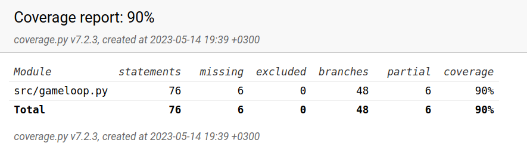

# Testausdokumentti

Ohjelman toimivuutta on testattu unittestia käyttäen. Se on varmistettu automatisoiduilla yksikkö- ja integraatiotesteillä. On myös tehty manuaalisilla arvoilla syötettyjä testejä. 

## Testilogiikka

Ohjelma avaa gameloop-luokka ja avaa siinä testejä, joissa se kokeilee muun muassa X:n tai O:n oikea talletus paikallaan käyttäjän klikatessa siihen kohtaan. Se testaa myös voittoehtoja. 

## Testikattavuus

Testikattavuuteen otettiin huomioon pelkästään pelin logiikkaan liittyvä moduuli eli Gameloop. Jätettiin pois kaikki käyttöliittymään liittyvät moduulit. 