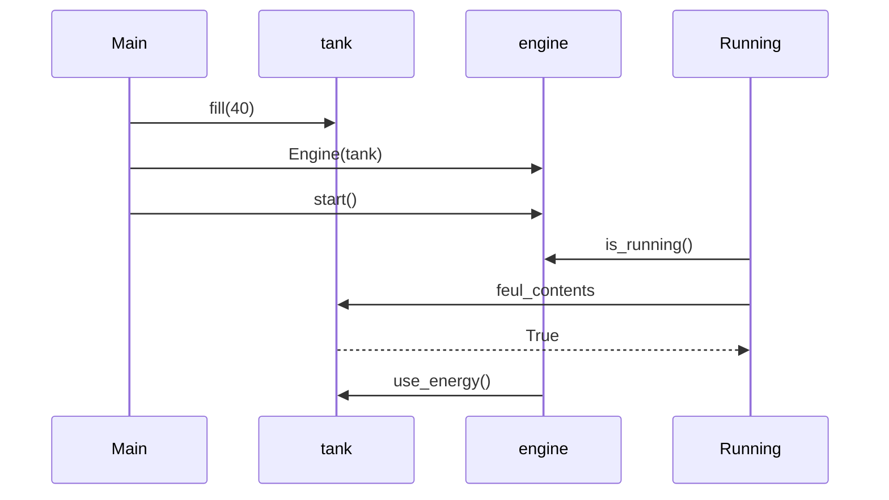

# Tehtävä 3

```mermaid

sequenceDiagram

    participant Main
    participant tank
    Main ->> tank: fill(40)
    participant engine
    Main ->> engine: Engine(tank)

    Main ->> engine: start()

    participant Running 

    Running ->> engine: is_running()

    
    Running ->> tank: feul_contents
    tank -->> Running: True

    engine ->> tank: use_energy()
    


    


```

