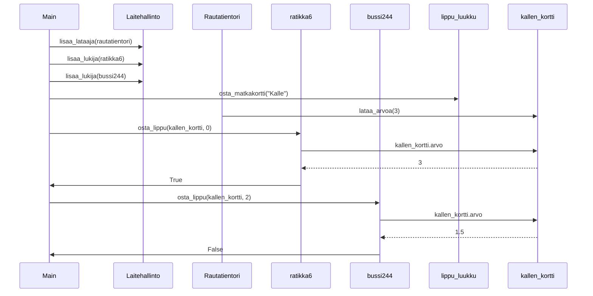

# Tehtävä 4

```mermaid

sequenceDiagram
    participant Main
    participant Laitehallinto
    participant Rautatientori
    participant ratikka6
    participant bussi244

    Main->>Laitehallinto: lisaa_lataaja(rautatientori)
    Main->>Laitehallinto: lisaa_lukija(ratikka6)
    Main->>Laitehallinto: lisaa_lukija(bussi244)

    participant lippu_luukku

    Main->>lippu_luukku: osta_matkakortti("Kalle")
    
    participant kallen_kortti

    Rautatientori->>kallen_kortti: lataa_arvoa(3)
    Main->>ratikka6: osta_lippu(kallen_kortti, 0)
    ratikka6->>kallen_kortti: kallen_kortti.arvo
    kallen_kortti-->>ratikka6: 3
    ratikka6->>Main: True

    Main->>bussi244: osta_lippu(kallen_kortti, 2)
    bussi244->>kallen_kortti: kallen_kortti.arvo
    kallen_kortti-->>bussi244: 1.5
    bussi244->>Main: False


```